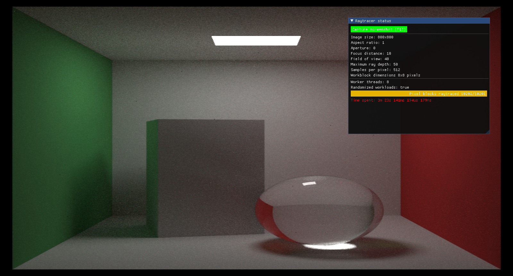
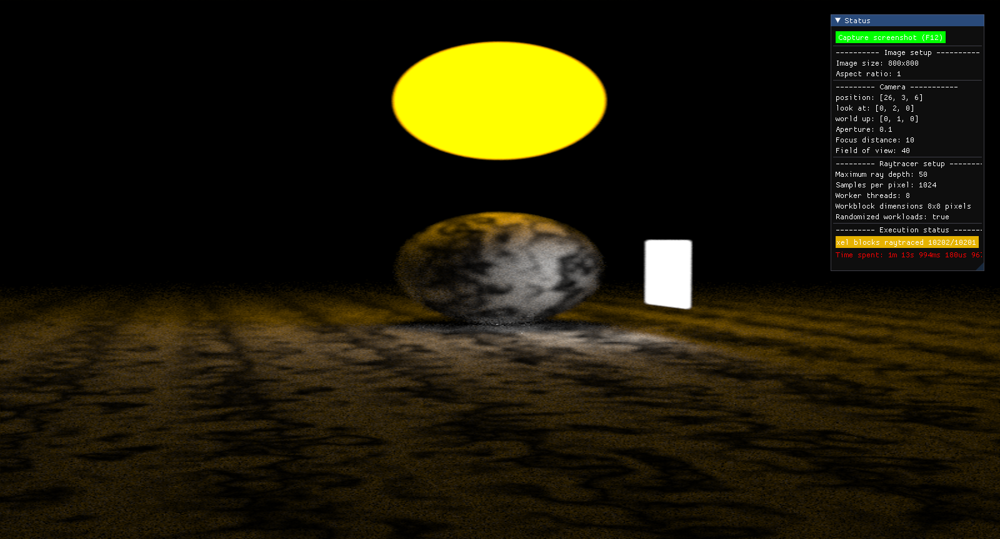
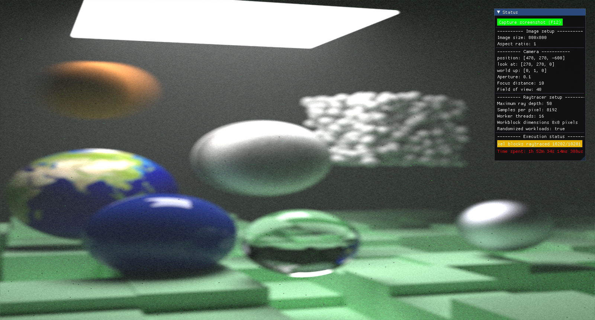
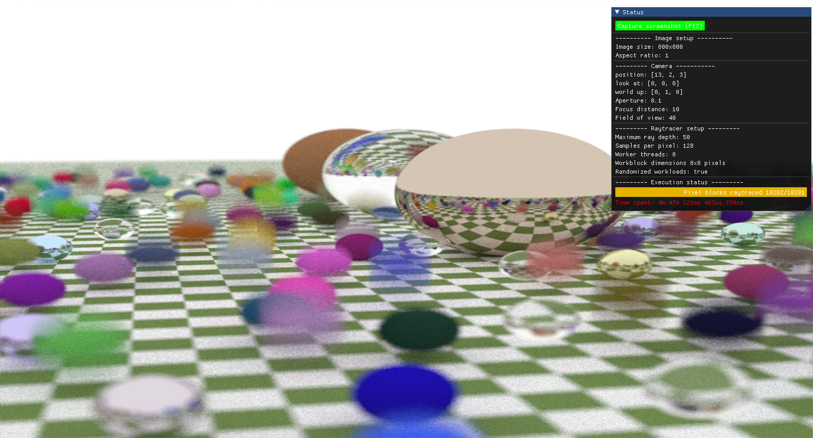
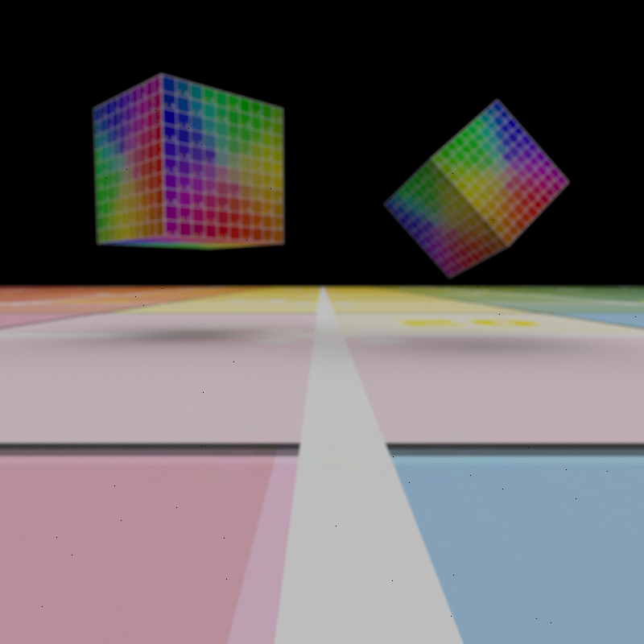

# README #

A Rust implementation of Raytracing In One Weekend

### References ###

* [Raytracing in one weekend series](https://raytracing.github.io) 

### How do I get set up? ###

``` sh
cargo run --release
```







